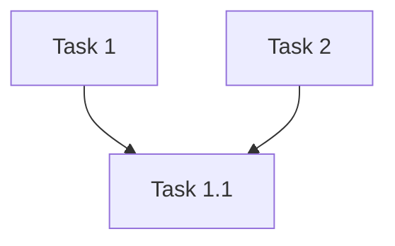

# Task Parallelization Skill

Analyze tasks defined in `tasks.md`, construct a dependency graph, and generate a **Parallelization Scheme** section that enables AI agents to execute independent tasks concurrently via the `subagent` tool.

## When to Invoke

- After the technical_po generates tasks in `tasks.md` (Gate E)
- When user requests parallelization analysis for existing tasks

## 1. Dependency Declaration Syntax

Tasks MUST declare dependencies using this format:

```markdown
- [ ] N. Task title
  - **Dependencies:** Task M, Task P
  - Step description
  - *Requirements: X.Y*
```

Tasks with NO dependencies omit the `**Dependencies:**` line entirely.

### Rules

- Dependencies reference task numbers: `Task 1`, `Task 2.1`, etc.
- A task with no `**Dependencies:**` line is a root task (can start immediately)
- Subtasks implicitly depend on their parent task

## 2. Analysis Process

### Step 1: Extract Tasks

Parse `tasks.md` for all task headings matching:
- `- [ ] N. Task title` (top-level)
- `- [ ] N.M Subtask title` (subtask)

For each task extract: ID, title, dependencies list, complexity (if present).

### Step 2: Validate

1. No dangling references (all dependencies must reference existing tasks)
2. No self-dependencies
3. No cycles

On validation error, report clearly and stop:

```
⚠️ Dependency Error in Task 1.3:
  - References "Task 2.5" but no task with ID "2.5" exists
  - Please fix and re-run analysis.
```

### Step 3: Assign Waves (Topological Sort)

1. Identify all tasks with no dependencies → Wave 1
2. Remove Wave 1 tasks from graph
3. Identify new tasks with no remaining dependencies → Wave 2
4. Repeat until all tasks assigned
5. If tasks remain unassigned → cycle detected, report and stop

### Step 4: Identify Critical Path

Find the longest dependency chain from any root to any leaf task.

## 3. Output Format

Append this section to `tasks.md` after all tasks:

```markdown
## Parallelization Scheme

### Wave 1 (No dependencies)
- **Task 1**: Task title
- **Task 5**: Task title

**Note:** These 2 tasks can be executed in parallel.

### Wave 2 (Depends on Wave 1)
- **Task 1.1**: Subtask title (depends on Task 1)
- **Task 5.1**: Subtask title (depends on Task 5)

**Note:** These 2 tasks can be executed in parallel after Wave 1 completes.

### Wave N (Final)
- **Task 10**: Final task (depends on all previous)

## Critical Path

**Critical Path:** Task 1 → Task 1.1 → Task 3 → Task 10

**Makespan Estimate (Sequential):** ~N tasks
**Makespan Estimate (Parallel):** ~M waves
```

### Formatting Rules

- Use `### Wave N` headings with dependency note
- Use `- **Task X**: Title (depends on Task Y)` format
- Always include "can be executed in parallel" note per wave
- Use simple language: "depends on", "can run in parallel"
- No technical jargon (DAG, topological sort, in-degree) in output

## 4. Cycle Detection Error

When a cycle is detected:

```markdown
⚠️ **Cyclic Dependency Detected**

**Cycle:** Task A → Task B → Task A

Resolution options:
1. Remove one dependency
2. Merge the cyclic tasks into one

Please update tasks.md to resolve this cycle.
```

Stop and wait for user fix. Do NOT proceed with partial analysis.

## 5. Mermaid Diagram (Optional, <20 tasks)

For fewer than 20 tasks, generate a dependency diagram:

```markdown
## Dependencies


```

Place before the Parallelization Scheme section.
