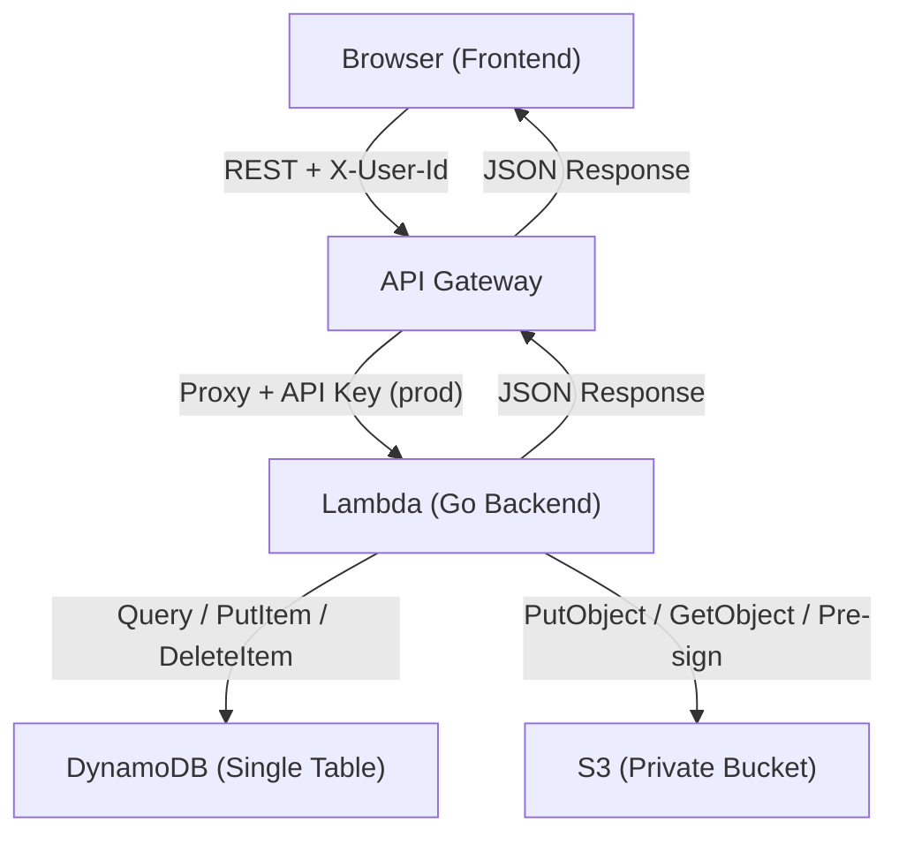
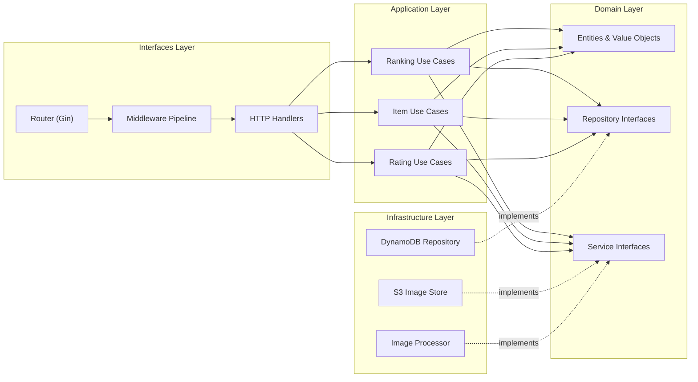
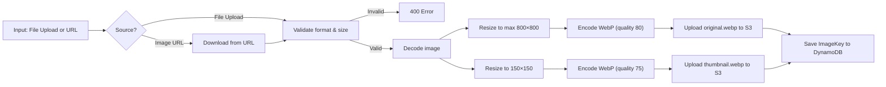
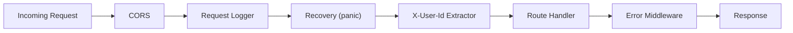
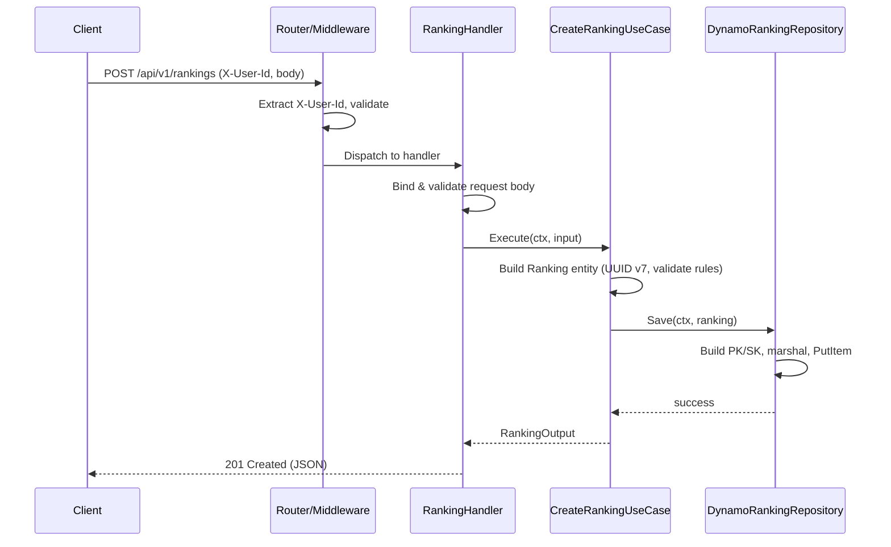
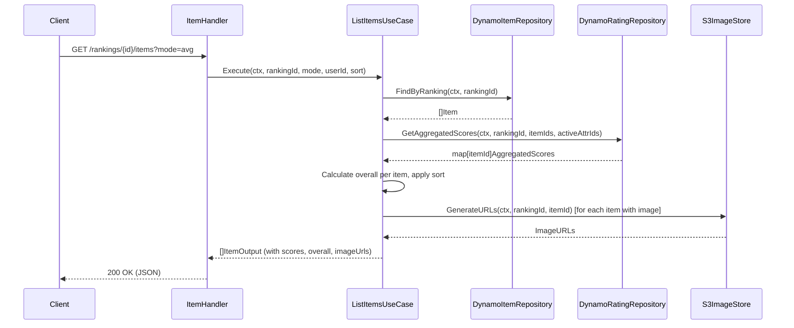
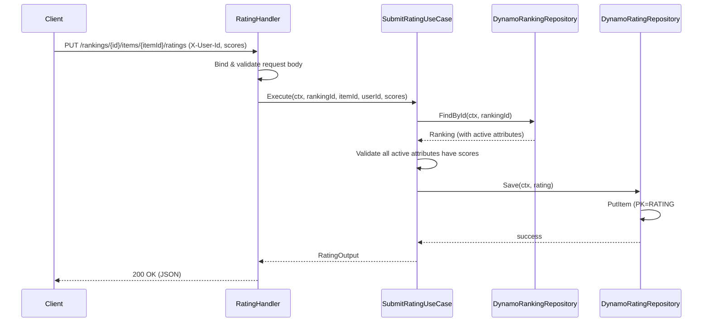

# Architecture & Design Document — Ranking Backend API

## 1. Architecture Overview

### 1.1 Architecture Style

The backend adopts **Clean Architecture** (Hexagonal / Ports & Adapters) combined with **Domain-Driven Design** tactical patterns. This style was chosen because:

- The domain is well-defined (rankings, items, ratings) with clear business rules.
- Infrastructure (DynamoDB, S3, Lambda) must be swappable for local development (LocalStack).
- Testability requires isolating domain logic from framework and infrastructure code.

### 1.2 System Context



### 1.3 Key Architectural Drivers

| Driver | Decision |
|---|---|
| **Simplicity** | Single Lambda, single DynamoDB table, single S3 bucket |
| **Cost** | Lambda ARM64 128 MB + DynamoDB on-demand = near-zero at low scale |
| **Statelessness** | No sessions, no cache — all state in DynamoDB/S3 |
| **Offline dev** | Same code paths for AWS and LocalStack via endpoint configuration |
| **No auth** | Browser UUID v7 via `X-User-Id` header — no OAuth, no JWT, no sessions |

### 1.4 Component Overview



---

## 2. Clean Architecture Layers

### 2.1 Dependency Rule

Dependencies flow **inward only**. The domain layer has zero external dependencies. Each outer layer depends on the layer immediately inside it, never the reverse.

```
Interfaces → Application → Domain ← Infrastructure
```

Infrastructure implements domain-defined interfaces (Dependency Inversion).

### 2.2 Layer Responsibilities

| Layer | Responsibility | Depends On | Examples |
|---|---|---|---|
| **Domain** | Entities, value objects, repository interfaces, domain services, business rules | Nothing | `Ranking`, `Item`, `Rating`, `Visibility`, `RankingRepository` |
| **Application** | Use case orchestration, input/output DTOs, application errors | Domain | `CreateRankingUseCase`, `SubmitRatingUseCase`, `ListItemsUseCase` |
| **Interfaces** | HTTP handlers, request/response mapping, middleware, router | Application | `RankingHandler`, `UserIdMiddleware`, `ErrorMiddleware` |
| **Infrastructure** | DynamoDB repository implementations, S3 client, image processor | Domain (interfaces) | `DynamoRankingRepository`, `S3ImageStore`, `WebPProcessor` |

### 2.3 Project Structure

```
backend/
├── cmd/
│   └── api/
│       └── main.go                     # Lambda entry point, DI wiring
├── internal/
│   ├── domain/
│   │   ├── ranking/
│   │   │   ├── entity.go               # Ranking entity
│   │   │   ├── attribute.go            # Attribute value object
│   │   │   ├── repository.go           # RankingRepository interface
│   │   │   └── errors.go               # Domain errors
│   │   ├── item/
│   │   │   ├── entity.go               # Item entity
│   │   │   ├── repository.go           # ItemRepository interface
│   │   │   └── errors.go
│   │   └── rating/
│   │       ├── entity.go               # Rating entity
│   │       ├── repository.go           # RatingRepository interface
│   │       └── errors.go
│   ├── application/
│   │   ├── ranking/
│   │   │   ├── create.go               # CreateRankingUseCase
│   │   │   ├── get.go                  # GetRankingUseCase
│   │   │   ├── update.go               # UpdateRankingUseCase
│   │   │   ├── delete.go               # DeleteRankingUseCase
│   │   │   ├── list.go                 # ListPublicRankingsUseCase
│   │   │   ├── recent.go               # GetRecentRankingsUseCase
│   │   │   ├── search.go               # SearchRankingsUseCase
│   │   │   ├── mine.go                 # ListMyRankingsUseCase
│   │   │   └── dto.go                  # Input/Output DTOs
│   │   ├── item/
│   │   │   ├── create.go               # AddItemUseCase
│   │   │   ├── list.go                 # ListItemsUseCase
│   │   │   ├── update.go               # UpdateItemUseCase
│   │   │   ├── delete.go               # DeleteItemUseCase
│   │   │   └── dto.go
│   │   └── rating/
│   │       ├── submit.go               # SubmitRatingUseCase
│   │       ├── get_mine.go             # GetMyRatingUseCase
│   │       └── dto.go
│   ├── interfaces/
│   │   └── http/
│   │       ├── handler/
│   │       │   ├── ranking.go          # Ranking HTTP handlers
│   │       │   ├── item.go             # Item HTTP handlers
│   │       │   ├── rating.go           # Rating HTTP handlers
│   │       │   └── health.go           # Health check handler
│   │       ├── middleware/
│   │       │   ├── userid.go           # X-User-Id extraction
│   │       │   ├── error.go            # Error handling middleware
│   │       │   ├── logging.go          # Request logging middleware
│   │       │   └── cors.go             # CORS middleware
│   │       ├── request/
│   │       │   └── validation.go       # Request validation helpers
│   │       ├── response/
│   │       │   ├── success.go          # Success response builders
│   │       │   ├── error.go            # Error response builders
│   │       │   └── pagination.go       # Pagination response helpers
│   │       └── router.go               # Gin router setup
│   └── infrastructure/
│       ├── dynamo/
│       │   ├── client.go               # DynamoDB client factory
│       │   ├── ranking_repository.go   # RankingRepository implementation
│       │   ├── item_repository.go      # ItemRepository implementation
│       │   ├── rating_repository.go    # RatingRepository implementation
│       │   ├── keys.go                 # PK/SK key builders
│       │   └── mapper.go               # Entity ↔ DynamoDB item mapping
│       ├── s3/
│       │   ├── client.go               # S3 client factory
│       │   └── image_store.go          # S3ImageStore implementation
│       └── image/
│           └── processor.go            # WebP optimization & thumbnail
├── pkg/
│   ├── apperror/
│   │   └── errors.go                   # Application error types & codes
│   ├── pagination/
│   │   └── cursor.go                   # Cursor encode/decode
│   ├── sorting/
│   │   └── parser.go                   # JSON:API sort parameter parser
│   └── uuid/
│       └── uuid.go                     # UUID v7 generation
├── go.mod
├── go.sum
├── Makefile
└── .golangci.yml
```

### 2.4 Dependency Injection

All dependencies are wired in `cmd/api/main.go` using **constructor injection**. No global variables, no service locators.

```
main.go:
  1. Load config (env vars)
  2. Create DynamoDB client
  3. Create S3 client
  4. Create repository implementations (pass clients)
  5. Create image processor
  6. Create use cases (pass repositories + services)
  7. Create handlers (pass use cases)
  8. Create router (pass handlers + middleware)
  9. Start Lambda adapter (or local HTTP server)
```

---

## 3. DynamoDB Single-Table Design

### 3.1 Table Configuration

| Property | Value |
|---|---|
| Table name | `ranking-main-{env}` |
| Billing mode | PAY_PER_REQUEST (on-demand) |
| Partition key | `PK` (String) |
| Sort key | `SK` (String) |
| Point-in-Time Recovery | Enabled |
| Encryption | AWS-managed (default) |

### 3.2 Access Patterns

Every feature maps to a DynamoDB `Query` operation. No `Scan` is used in production.

| # | Access Pattern | Operation | Key Condition | Index |
|---|---|---|---|---|
| AP1 | Get ranking by ID | Query | `PK = RANKING#<id>`, `SK = METADATA` | Table |
| AP2 | List items in a ranking | Query | `PK = RANKING#<id>`, `SK begins_with ITEM#` | Table |
| AP3 | Get single item | Query | `PK = RANKING#<id>`, `SK = ITEM#<itemId>` | Table |
| AP4 | Get all ratings for an item (all users) | Query | `PK = RATING#<rankingId>#<itemId>`, `SK begins_with USER#` | Table |
| AP5 | Get one user's rating for an item | Query | `PK = RATING#<rankingId>#<itemId>`, `SK = USER#<userId>` | Table |
| AP6 | List rankings by owner (My Rankings) | Query | `GSI1PK = OWNER#<userId>`, `GSI1SK begins_with RANKING#` | GSI1 |
| AP7 | List public rankings (recent) | Query | `GSI2PK = PUBLIC`, `GSI2SK` (desc by createdAt) | GSI2 |
| AP8 | Search by tag | Query | `GSI3PK = TAG#<tag>`, `GSI3SK` (desc by createdAt) | GSI3 |

> **AP7 note:** `GSI2SK` stores the ISO 8601 timestamp, enabling `ScanIndexForward: false` for newest-first ordering. The `recent` endpoint uses `Limit: 10` on this query.

> **Search by name (AP for REQ-07 `q` parameter):** DynamoDB does not natively support case/accent-insensitive partial text search. This is handled by storing a **normalized name** (`nameLower` — lowercased, accent-stripped) and using `contains` as a `FilterExpression` on the GSI2 query. Since the GSI2 partition is `PUBLIC` (all public rankings), the filter operates on a bounded set. See section 3.7 for trade-off analysis.

### 3.3 Key Schema

| Entity | PK | SK | GSI1PK | GSI1SK | GSI2PK | GSI2SK | GSI3PK | GSI3SK |
|---|---|---|---|---|---|---|---|---|
| Ranking | `RANKING#<id>` | `METADATA` | `OWNER#<userId>` | `RANKING#<createdAt>` | `PUBLIC` (if public) | `<createdAt>` | — | — |
| Ranking-Tag | `RANKING#<id>` | `TAG#<tag>` | — | — | — | — | `TAG#<tag>` | `<createdAt>#<rankingId>` |
| Item | `RANKING#<id>` | `ITEM#<itemId>` | — | — | — | — | — | — |
| Rating | `RATING#<rankingId>#<itemId>` | `USER#<userId>` | — | — | — | — | — | — |

### 3.4 Global Secondary Indexes

| Index | Partition Key | Sort Key | Projection | Purpose |
|---|---|---|---|---|
| **GSI1** | `GSI1PK` | `GSI1SK` | `KEYS_ONLY` + selected attrs | My Rankings (AP6) |
| **GSI2** | `GSI2PK` | `GSI2SK` | `KEYS_ONLY` + selected attrs | Public rankings listing & recent (AP7) |
| **GSI3** | `GSI3PK` | `GSI3SK` | `KEYS_ONLY` + selected attrs | Tag search (AP8) |

All GSIs are **sparse**: only items with the relevant GSI keys are projected. For example, private rankings have no `GSI2PK`, so they never appear in GSI2.

### 3.5 Entity Attribute Map

#### Ranking (METADATA item)

| Attribute | Type | Description |
|---|---|---|
| `PK` | S | `RANKING#<id>` |
| `SK` | S | `METADATA` |
| `Id` | S | UUID v7 |
| `Name` | S | Ranking name (1–100 chars) |
| `NameLower` | S | Lowercased, accent-stripped name for search |
| `Description` | S | Optional (max 500 chars) |
| `Visibility` | S | `public` or `private` |
| `Tags` | L | List of tag strings |
| `Attributes` | L | List of `{id, name, description, active}` maps |
| `OwnerUserId` | S | Creator's UUID v7 |
| `CreatedAt` | S | ISO 8601 timestamp |
| `UpdatedAt` | S | ISO 8601 timestamp |
| `Type` | S | `RANKING` |
| `GSI1PK` | S | `OWNER#<userId>` |
| `GSI1SK` | S | `RANKING#<createdAt>` |
| `GSI2PK` | S | `PUBLIC` (only if public) |
| `GSI2SK` | S | `<createdAt>` (only if public) |

#### Ranking-Tag (one item per tag)

| Attribute | Type | Description |
|---|---|---|
| `PK` | S | `RANKING#<id>` |
| `SK` | S | `TAG#<tagValue>` |
| `RankingId` | S | UUID v7 |
| `RankingName` | S | Denormalized for GSI3 projection |
| `Tag` | S | Tag value |
| `CreatedAt` | S | Ranking's createdAt |
| `Type` | S | `RANKING_TAG` |
| `GSI3PK` | S | `TAG#<tagValue>` |
| `GSI3SK` | S | `<createdAt>#<rankingId>` |

#### Item

| Attribute | Type | Description |
|---|---|---|
| `PK` | S | `RANKING#<rankingId>` |
| `SK` | S | `ITEM#<itemId>` |
| `Id` | S | UUID v7 |
| `Name` | S | Item name (1–100 chars) |
| `ImageKey` | S | S3 object key (or empty) |
| `CreatedBy` | S | Creator's UUID v7 |
| `CreatedAt` | S | ISO 8601 timestamp |
| `UpdatedAt` | S | ISO 8601 timestamp |
| `Type` | S | `ITEM` |

#### Rating

| Attribute | Type | Description |
|---|---|---|
| `PK` | S | `RATING#<rankingId>#<itemId>` |
| `SK` | S | `USER#<userId>` |
| `RankingId` | S | UUID v7 |
| `ItemId` | S | UUID v7 |
| `UserId` | S | UUID v7 |
| `Scores` | M | Map of `{attributeId: score}` (integer 0–100) |
| `CreatedAt` | S | ISO 8601 timestamp |
| `UpdatedAt` | S | ISO 8601 timestamp |
| `Type` | S | `RATING` |

### 3.6 Soft-Delete Strategy for Removed Attributes

When an attribute is removed from a ranking (REQ-03, A29):

1. The attribute's `active` flag is set to `false` in the ranking's `Attributes` list.
2. Existing ratings retain their scores for that attribute in the `Scores` map.
3. When calculating averages (REQ-10), the backend filters `Scores` to include only **active** attribute IDs.
4. The attribute data is never physically deleted — it can be reactivated if the creator re-adds an attribute with the same ID.

### 3.7 Search Trade-Off: FilterExpression on GSI2

Full-text search is not a DynamoDB strength. The chosen approach:

- **Tag search (AP8):** Exact match via GSI3 `Query` — efficient, no filter needed.
- **Name search (REQ-07 `q`):** Query GSI2 (`PUBLIC` partition) with `FilterExpression contains(NameLower, :term)`.

**Why this is acceptable:**
- The `PUBLIC` partition contains only public rankings.
- `FilterExpression` runs server-side after the key condition, so it does not cause a full table scan.
- At small-to-medium scale (thousands of rankings), the RCU cost is manageable.
- The `NameLower` field is pre-normalized at write time (lowercase + accent-stripped).

**When to revisit:** If the number of public rankings exceeds ~10,000, consider migrating search to **OpenSearch** or **Algolia**. This is documented as a known architectural constraint (see section 7).

---

## 4. S3 Image Strategy

### 4.1 Bucket Configuration

| Property | Value |
|---|---|
| Bucket name | `ranking-images-{env}` |
| Public access | **Blocked** (all public access settings disabled) |
| Encryption | SSE-S3 (AES-256, default) |
| Versioning | Disabled (images are replaced, not versioned) |
| Lifecycle | None (images persist until item/ranking deletion) |

### 4.2 Object Key Structure

```
items/{rankingId}/{itemId}/original.webp
items/{rankingId}/{itemId}/thumbnail.webp
```

This structure enables efficient cleanup: deleting a ranking or item means deleting all objects under the prefix `items/{rankingId}/` or `items/{rankingId}/{itemId}/`.

### 4.3 Image Processing Pipeline



### 4.4 Pre-Signed URL Generation

When an item is returned in an API response:

1. If `ImageKey` is non-empty, the backend generates two pre-signed `GetObject` URLs:
   - `imageUrl` → `items/{rankingId}/{itemId}/original.webp` (1-hour expiry)
   - `thumbnailUrl` → `items/{rankingId}/{itemId}/thumbnail.webp` (1-hour expiry)
2. If `ImageKey` is empty, both fields are `null` in the response.

Pre-signed URLs are generated **at response time**, never stored in DynamoDB.

### 4.5 Image Cleanup

| Event | Action |
|---|---|
| Item deleted (REQ-12) | Delete `items/{rankingId}/{itemId}/*` from S3 |
| Item image replaced (REQ-11) | Overwrite existing objects (same keys) |
| Ranking deleted (REQ-04) | Delete `items/{rankingId}/*` from S3 (batch) |

### 4.6 Domain Interface

The domain defines an `ImageStore` interface. The infrastructure layer implements it with S3:

```go
// domain/item/image_store.go
type ImageStore interface {
    Store(ctx context.Context, rankingID, itemID string, data []byte) (ImageResult, error)
    GenerateURLs(ctx context.Context, rankingID, itemID string) (ImageURLs, error)
    Delete(ctx context.Context, rankingID, itemID string) error
    DeleteByRanking(ctx context.Context, rankingID string) error
}
```

The `ImageProcessor` interface handles format validation, resizing, and encoding:

```go
// domain/item/image_processor.go
type ImageProcessor interface {
    Process(data []byte) (original []byte, thumbnail []byte, err error)
    ValidateFormat(data []byte) error
}
```

---

## 5. API Layer Design

### 5.1 Middleware Pipeline

Every request passes through the middleware chain in order:



| Middleware | Responsibility |
|---|---|
| **CORS** | Sets `Access-Control-Allow-*` headers. Returns `204` for preflight. |
| **Request Logger** | Generates `requestId`, logs method/path/latency/status via `slog`. |
| **Recovery** | Catches panics, logs stack trace, returns `500 INTERNAL_ERROR`. |
| **X-User-Id Extractor** | Parses `X-User-Id` header, validates UUID format, injects into Gin context. Does NOT reject — individual handlers decide if the ID is required. |
| **Error Middleware** | Catches `c.Error()` calls from handlers, maps domain/application errors to structured JSON responses. |

### 5.2 Route Registration

```go
// router.go (pseudocode)
v1 := r.Group("/api/v1")

// Health
v1.GET("/health", healthHandler.Check)

// Swagger
v1.GET("/swagger/*any", ginSwagger.WrapHandler(...))

// Rankings
v1.POST("/rankings", requireUserId, rankingHandler.Create)
v1.GET("/rankings", rankingHandler.List)
v1.GET("/rankings/recent", rankingHandler.Recent)
v1.GET("/rankings/search", rankingHandler.Search)
v1.GET("/rankings/mine", requireUserId, rankingHandler.Mine)
v1.GET("/rankings/:id", rankingHandler.Get)
v1.PUT("/rankings/:id", requireUserId, rankingHandler.Update)
v1.DELETE("/rankings/:id", requireUserId, rankingHandler.Delete)

// Items
v1.POST("/rankings/:id/items", requireUserId, itemHandler.Create)
v1.GET("/rankings/:id/items", itemHandler.List)
v1.PUT("/rankings/:id/items/:itemId", requireUserId, itemHandler.Update)
v1.DELETE("/rankings/:id/items/:itemId", requireUserId, itemHandler.Delete)

// Ratings
v1.PUT("/rankings/:id/items/:itemId/ratings", requireUserId, ratingHandler.Submit)
v1.GET("/rankings/:id/items/:itemId/ratings/mine", requireUserId, ratingHandler.GetMine)
```

`requireUserId` is a middleware that rejects requests without a valid `X-User-Id`.

### 5.3 Sequence Diagram — Create Ranking



### 5.4 Sequence Diagram — List Items with Scores



### 5.5 Sequence Diagram — Submit Rating



---

## 6. Cross-Cutting Concerns

### 6.1 Error Handling Strategy

Errors flow through three layers, each with a distinct responsibility:

| Layer | Error Type | Example |
|---|---|---|
| **Domain** | Domain errors (value objects, business rules) | `ErrMaxAttributesExceeded`, `ErrInvalidVisibility` |
| **Application** | Application errors (use case failures) | `ErrRankingNotFound`, `ErrNotOwner`, `ErrIncompleteRatings` |
| **Interfaces** | HTTP error mapping | Domain/App error → `{ "error": { "code", "message", "status" } }` |

The error middleware in the interfaces layer maps application errors to HTTP responses:

```go
// pkg/apperror/errors.go
type AppError struct {
    Code    string // e.g., "RANKING_NOT_FOUND"
    Message string // Human-readable
    Status  int    // HTTP status code
}
```

Handlers call `c.Error(appErr)` and the error middleware serializes it. Unrecognized errors become `500 INTERNAL_ERROR`.

### 6.2 Logging Strategy

| Environment | Format | Output | Level |
|---|---|---|---|
| Local | Text with color (`gin.ForceConsoleColor()`) | stdout | Debug |
| Production | JSON (`slog.NewJSONHandler`) | stdout → CloudWatch | Info |

Every log entry includes:

```json
{
  "requestId": "uuid",
  "method": "POST",
  "path": "/api/v1/rankings",
  "statusCode": 201,
  "latency": "12ms",
  "userId": "uuid-or-empty",
  "env": "prod",
  "service": "ranking-api"
}
```

Error-level logs add: `errorCode`, `errorMessage`. No stack traces in production responses — only in logs.

### 6.3 Pagination

All list endpoints use cursor-based pagination:

**Request:**
```
GET /api/v1/rankings?limit=20&cursor=eyJQSyI6Ii4uLiJ9
```

**Response:**
```json
{
  "data": [...],
  "pagination": {
    "nextCursor": "eyJQSyI6Ii4uLiIsIlNLIjoiLi4uIn0=",
    "hasMore": true
  }
}
```

**Cursor implementation:**
- The cursor is a **base64-encoded JSON** of DynamoDB's `LastEvaluatedKey`.
- On the next request, the backend decodes the cursor and passes it as `ExclusiveStartKey`.
- Invalid cursors return `400 INVALID_CURSOR`.
- The cursor is opaque to the client — its internal structure is an implementation detail.

### 6.4 Sorting

Sorting follows JSON:API convention. The `pkg/sorting` package provides a reusable parser:

**Input:** `sort=-overall,name`

**Output:**
```go
[]SortField{
    {Field: "overall", Direction: Descending},
    {Field: "name", Direction: Ascending},
}
```

**Implementation notes:**
- Rankings sorting (`name`, `createdAt`, `updatedAt`) is handled by choosing the appropriate GSI or table query order.
- Items sorting (`name`, `overall`, attribute scores) is performed **in-memory** after fetching all items for a ranking. This is acceptable because a ranking has at most 100 items (A32).
- If `sort` is not provided, defaults apply: `-createdAt` for rankings, `-overall` for items.

### 6.5 Score Aggregation

The `ListItemsUseCase` computes scores differently based on mode:

**Mode `avg` (default):**
1. Query all ratings for each item (AP4).
2. For each active attribute, compute the arithmetic mean across all users.
3. Compute `overall` = mean of all active attribute averages.

**Mode `user`:**
1. Query the specific user's rating (AP5).
2. Return the user's scores directly.
3. Compute `overall` = mean of the user's active attribute scores.

In both modes, only **active** attributes are included (soft-deleted attributes are excluded per A29).

---

## 7. Architectural Decisions, Constraints & Trade-Offs

### 7.1 Key Architectural Decisions

| # | Decision | Rationale | Alternatives Considered |
|---|---|---|---|
| **ADR-01** | Single Lambda for all endpoints | Simplicity, single deployment unit, shared cold start. 128 MB is sufficient for a Go binary. | Multiple Lambdas per resource — rejected due to operational overhead at this scale. |
| **ADR-02** | Single DynamoDB table | Mandated by steering docs. Reduces cost, simplifies transactions, enables atomic operations across entities. | Multi-table — explicitly forbidden. |
| **ADR-03** | Cursor-based pagination | Natural fit for DynamoDB `LastEvaluatedKey`. Consistent results with concurrent writes. | Offset-based — poor fit for DynamoDB, inconsistent with inserts/deletes. |
| **ADR-04** | In-memory sorting for items | Max 100 items per ranking makes in-memory sort trivial and avoids complex GSI designs for dynamic attribute-based sorting. | DynamoDB-level sorting — impractical for dynamic attribute names as sort keys. |
| **ADR-05** | FilterExpression for name search | Acceptable at small scale on the bounded `PUBLIC` GSI2 partition. Avoids introducing a search service for MVP. | OpenSearch/Algolia — overkill for MVP, adds cost and complexity. |
| **ADR-06** | Pre-signed URLs at response time | Keeps S3 private, no stored URLs that expire, simple invalidation (just re-request). | CloudFront signed URLs — adds CDN complexity not needed at MVP scale. |
| **ADR-07** | Soft-delete for removed attributes | Preserves historical rating data, allows re-activation, avoids complex cascading deletes on attribute removal. | Hard delete ratings — data loss, violates user expectations. |
| **ADR-08** | Tags as separate DynamoDB items | Enables efficient GSI3 query for tag search without scanning the full ranking item. One item per tag per ranking. | Tags as list attribute with FilterExpression — poor query performance. |
| **ADR-09** | Score aggregation at read time | Overall is never stored (product requirement). Aggregation on ≤100 items × ≤6 attributes is fast. | Pre-computed aggregates with DynamoDB Streams — premature optimization, adds complexity. |
| **ADR-10** | UUID v7 for all entity IDs | Time-ordered, globally unique, no coordination needed. Sorts chronologically by default. | ULID, auto-increment — ULID is equivalent; auto-increment requires coordination. |

### 7.2 Constraints

| Constraint | Impact |
|---|---|
| **Single DynamoDB table** | All entities share one table. Key design must be carefully planned. Schema changes require migration strategies. |
| **Lambda 128 MB** | Image processing (resize, WebP encode) must fit in memory. A 10 MB upload decoded to bitmap can use ~40 MB. 128 MB is tight — monitor and increase if needed. |
| **No authentication** | Any client can impersonate any user by sending a different `X-User-Id`. Acceptable per product decision, but limits future features (e.g., moderation, abuse prevention). |
| **DynamoDB search limitations** | No native full-text search. Name search uses `FilterExpression` which reads and discards non-matching items (RCU cost). |
| **Max 100 items per ranking** | Enables in-memory sorting and full-fetch patterns. If this limit increases, the items listing strategy must be revisited. |

### 7.3 Trade-Offs

| Trade-Off | Chosen Side | Consequence |
|---|---|---|
| **Simplicity vs. Search quality** | Simplicity (FilterExpression) | Name search is basic (substring match). No relevance scoring, no fuzzy matching. Acceptable for MVP. |
| **Cost vs. Performance** | Cost (on-demand, 128 MB Lambda) | Cold starts may reach 200–500ms for Go. Acceptable for a non-real-time product. |
| **Data integrity vs. Flexibility** | Flexibility (soft-delete attributes) | Soft-deleted attribute data accumulates over time. May need a cleanup job eventually. |
| **Consistency vs. Latency** | Eventual consistency | All DynamoDB reads use eventually consistent mode. A rating submitted by user A may take up to 1 second to appear in user B's aggregated view. |
| **Single Lambda vs. Granular scaling** | Single Lambda | All endpoints share the same concurrency pool. A spike in image uploads could affect read latency. Mitigated by Lambda's concurrency model. |

### 7.4 Risks

| Risk | Likelihood | Impact | Mitigation |
|---|---|---|---|
| **Name search performance degrades** at >10K public rankings | Medium | High (slow responses, high RCU) | Monitor RCU on GSI2. Migrate to OpenSearch when needed. |
| **Lambda memory exceeded** during image processing | Low | High (invocation failure) | Monitor memory usage. Increase to 256 MB if 128 MB is insufficient. |
| **User ID spoofing** (malicious user impersonates another) | Medium | Medium (data tampering) | Accepted risk per product decision. No sensitive data involved. Add rate limiting per IP if abuse detected. |
| **Hot partition on GSI2** (`PUBLIC` key) | Low | Medium (throttling) | DynamoDB adaptive capacity handles this. At extreme scale, shard the `PUBLIC` key (e.g., `PUBLIC#0`..`PUBLIC#9`). |
| **Cascade delete timeout** for large rankings | Low | Medium (partial deletion) | Use batch delete with retry. Consider DynamoDB Streams + async cleanup for rankings with many items. |

---

## 8. Requirement Traceability

| Requirement | Architecture Section |
|---|---|
| REQ-01 to REQ-04 (Rankings CRUD) | §2 Layers, §3 DynamoDB (AP1, Key Schema), §5.3 Sequence |
| REQ-05 to REQ-08 (Listing/Search/Discovery) | §3 DynamoDB (AP6, AP7, AP8, GSIs), §6.3 Pagination, §6.4 Sorting |
| REQ-09 to REQ-12 (Items CRUD) | §3 DynamoDB (AP2, AP3), §4 S3 Strategy |
| REQ-13 (Image Processing) | §4 S3 Strategy (§4.3 Pipeline, §4.4 Pre-signed URLs) |
| REQ-14, REQ-15 (Ratings) | §3 DynamoDB (AP4, AP5), §5.5 Sequence, §6.5 Aggregation |
| REQ-16 (Health Check) | §5.2 Route Registration |
| REQ-17 (Error Responses) | §6.1 Error Handling Strategy |
| REQ-18 (Pagination) | §6.3 Pagination |
| REQ-19 (Sorting) | §6.4 Sorting |
| REQ-20 (Swagger) | §5.2 Route Registration |
| REQ-21 (Validation) | §5.1 Middleware, §2.3 Project Structure (request/) |
| REQ-22 (X-User-Id) | §5.1 Middleware Pipeline |
| REQ-23 (Logging) | §6.2 Logging Strategy |
| REQ-24 (CORS) | §5.1 Middleware Pipeline |
