- [ ] 1. Initialize Go project and configure tooling

  - Initialize Go module at `backend/` with `go mod init`
  - Create `cmd/api/main.go` with minimal placeholder
  - Create `.golangci.yml` with strict lint rules (no `any` abuse, no `interface{}`, enforce `slog`, enforce `fmt.Sprintf`)
  - Create `Makefile` with `dev/run`, `dev/build`, `test/unit`, `lint/go` targets following environment-first naming
  - Create `.env.local` with `ENV=local`, `AWS_REGION=us-east-1`, `AWS_ENDPOINT_URL=http://localhost:4566`, `DYNAMODB_TABLE_MAIN=ranking-main-local`, `S3_BUCKET_IMAGES=ranking-images-local`, `CORS_ORIGIN=http://localhost:3000`
  - Add `go.sum` to version control
  - *Requirements: REQ-20, REQ-23, REQ-24*

- [ ] 2. Implement shared packages (`pkg/`)

  - [ ] 2.1 Implement `pkg/apperror` — application error types

    - Create `AppError` struct with `Code`, `Message`, `Status` fields
    - Define all error code constants: `VALIDATION_ERROR`, `MISSING_USER_ID`, `RANKING_NOT_FOUND`, `ITEM_NOT_FOUND`, `NOT_OWNER`, `NOT_AUTHORIZED`, `INVALID_SORT_FIELD`, `INVALID_CURSOR`, `INCOMPLETE_RATINGS`, `INVALID_IMAGE_FORMAT`, `IMAGE_TOO_LARGE`, `IMAGE_DOWNLOAD_FAILED`, `MAX_ITEMS_REACHED`, `INTERNAL_ERROR`
    - Implement `Error()` method to satisfy `error` interface
    - Implement constructor functions: `NewValidationError(msg)`, `NewNotFoundError(code, msg)`, `NewForbiddenError(code, msg)`, `NewBadRequestError(code, msg)`, `NewInternalError()`
    - Write unit tests for all constructors and error code mappings
    - *Requirements: REQ-17*

  - [ ] 2.2 Implement `pkg/pagination` — cursor encode/decode

    - **Dependencies:** Task 2.1
    - Implement `EncodeCursor(lastEvaluatedKey map[string]types.AttributeValue) string` — base64-encode JSON of DynamoDB `LastEvaluatedKey`
    - Implement `DecodeCursor(cursor string) (map[string]types.AttributeValue, error)` — decode and validate, return `INVALID_CURSOR` error on failure
    - Implement `ClampLimit(limit, defaultLimit, maxLimit int) int` — clamp to range, default 20, max 50
    - Write unit tests: valid cursor round-trip, invalid base64, invalid JSON, empty cursor, limit clamping edge cases
    - Write property-based tests: **Property: any valid LastEvaluatedKey encodes and decodes to the same value**
    - *Requirements: REQ-18*

  - [ ] 2.3 Implement `pkg/sorting` — JSON:API sort parameter parser

    - **Dependencies:** Task 2.1
    - Define `SortField` struct with `Field string` and `Direction` (Ascending/Descending)
    - Implement `ParseSort(param string, allowedFields []string) ([]SortField, error)` — split by `,`, strip `-`/`+` prefix, validate against allowed fields, return `INVALID_SORT_FIELD` error for unknown fields
    - Write unit tests: single field, multiple fields, descending prefix, ascending prefix, invalid field, empty string
    - Write property-based tests: **Property: any combination of allowed fields with valid prefixes parses without error**
    - *Requirements: REQ-19*

  - [ ] 2.4 Implement `pkg/uuid` — UUID v7 generation

    - Implement `New() string` — generate UUID v7
    - Implement `IsValid(id string) bool` — validate UUID format
    - Write unit tests: generated UUID is valid, uniqueness, format validation
    - *Requirements: REQ-01, REQ-09, REQ-14*

- [ ] 3. Implement domain layer (`internal/domain/`)

  - [ ] 3.1 Implement `domain/ranking` — Ranking entity and value objects

    - **Dependencies:** Task 2.4
    - Create `Ranking` entity with fields: `ID`, `Name`, `NameLower`, `Description`, `Visibility`, `Tags`, `Attributes`, `OwnerUserId`, `CreatedAt`, `UpdatedAt`
    - Create `Attribute` value object with fields: `ID`, `Name`, `Description`, `Active`
    - Create `Visibility` value object (`public`/`private`) with validation
    - Implement `NewRanking(name, description, visibility, tags, attributes, ownerUserId)` constructor with all business rule validation: name 1–100 chars, description max 500, visibility valid, tags max 10, attributes 1–6, attribute name 1–50, attribute description max 200
    - Implement `Ranking.Update(name, description, visibility, tags, attributes)` method with soft-delete logic for removed attributes
    - Implement `Ranking.IsOwner(userId) bool`
    - Implement `Ranking.ActiveAttributes() []Attribute`
    - Implement `NormalizeName(name string) string` — lowercase + accent-strip for search
    - Define `RankingRepository` interface: `Save`, `FindByID`, `Update`, `Delete`, `ListPublic`, `ListByOwner`, `SearchByName`, `SearchByTag`, `FindRecent`
    - Define domain errors: `ErrMaxAttributesExceeded`, `ErrInvalidVisibility`, `ErrNameRequired`, `ErrMaxTagsExceeded`
    - Write unit tests for all entity constructors, validation rules, soft-delete logic, name normalization
    - Write property-based tests:
      - **Property: ranking with 0 or >6 attributes always fails validation**
      - **Property: ranking with >10 tags always fails validation**
      - **Property: NormalizeName is idempotent (normalizing twice yields same result)**
      - **Property: visibility only accepts "public" or "private"**
    - *Requirements: REQ-01, REQ-02, REQ-03, REQ-04, REQ-05, REQ-06, REQ-07, REQ-08, REQ-21*

  - [ ] 3.2 Implement `domain/item` — Item entity and interfaces

    - **Dependencies:** Task 2.4
    - Create `Item` entity with fields: `ID`, `Name`, `ImageKey`, `RankingID`, `CreatedBy`, `CreatedAt`, `UpdatedAt`
    - Implement `NewItem(name, rankingID, createdBy)` constructor with validation: name 1–100 chars
    - Implement `Item.Update(name)` method
    - Implement `Item.CanBeModifiedBy(userId, rankingOwnerUserId) bool` — returns true if userId matches `CreatedBy` or `rankingOwnerUserId`
    - Define `ItemRepository` interface: `Save`, `FindByID`, `FindByRanking`, `Update`, `Delete`, `DeleteByRanking`, `CountByRanking`
    - Define `ImageStore` interface: `Store`, `GenerateURLs`, `Delete`, `DeleteByRanking`
    - Define `ImageProcessor` interface: `Process`, `ValidateFormat`
    - Define domain errors: `ErrItemNameRequired`, `ErrMaxItemsReached`
    - Write unit tests for entity constructor, validation, permission check
    - Write property-based tests:
      - **Property: item name empty or >100 chars always fails validation**
      - **Property: CanBeModifiedBy returns true for ranking owner regardless of createdBy**
    - *Requirements: REQ-09, REQ-10, REQ-11, REQ-12, REQ-13, REQ-21*

  - [ ] 3.3 Implement `domain/rating` — Rating entity

    - **Dependencies:** Task 2.4
    - Create `Rating` entity with fields: `RankingID`, `ItemID`, `UserID`, `Scores` (map[string]int), `CreatedAt`, `UpdatedAt`
    - Implement `NewRating(rankingID, itemID, userID, scores, activeAttributeIDs)` constructor with validation: all active attributes must have scores, each score integer 0–100
    - Implement `Rating.CalculateOverall(activeAttributeIDs []string) float64` — arithmetic mean of scores for active attributes only
    - Define `RatingRepository` interface: `Save`, `FindByUserAndItem`, `FindAllByItem`, `DeleteByItem`, `DeleteByRanking`
    - Define domain errors: `ErrIncompleteRatings`, `ErrInvalidScore`
    - Write unit tests for entity constructor, validation, overall calculation
    - Write property-based tests:
      - **Property: rating with missing attribute scores always fails validation**
      - **Property: rating with any score <0 or >100 always fails validation**
      - **Property: overall is always between 0 and 100 when all scores are valid**
      - **Property: overall equals the arithmetic mean of active attribute scores**
    - *Requirements: REQ-14, REQ-15, REQ-21*

- [ ] 4. Implement DynamoDB infrastructure (`internal/infrastructure/dynamo/`)

  - [ ] 4.1 Implement DynamoDB client factory and key builders

    - **Dependencies:** Task 3.1
    - Implement `NewDynamoClient(cfg)` — create DynamoDB client with optional `AWS_ENDPOINT_URL` for LocalStack
    - Implement `keys.go` with PK/SK builder functions: `RankingPK(id)`, `MetadataSK()`, `ItemSK(itemId)`, `TagSK(tag)`, `RatingPK(rankingId, itemId)`, `UserSK(userId)`, `OwnerGSI1PK(userId)`, `RankingGSI1SK(createdAt)`, `PublicGSI2PK()`, `TagGSI3PK(tag)`, `TagGSI3SK(createdAt, rankingId)`
    - Implement `mapper.go` with marshal/unmarshal functions for Ranking, Item, Rating, RankingTag entities to/from DynamoDB attribute maps
    - Write unit tests for all key builders and mappers
    - *Requirements: REQ-01, REQ-02, REQ-09, REQ-14*

  - [ ] 4.2 Implement `DynamoRankingRepository`

    - **Dependencies:** Task 4.1
    - Implement `Save(ctx, ranking)` — PutItem for ranking METADATA + BatchWriteItem for tag items (GSI3), set GSI1/GSI2 keys based on visibility
    - Implement `FindByID(ctx, id)` — Query PK=RANKING#id, SK=METADATA
    - Implement `Update(ctx, ranking)` — UpdateItem for METADATA + reconcile tag items (delete removed, add new)
    - Implement `Delete(ctx, id)` — BatchWriteItem to delete METADATA + all TAG# items + all ITEM# items under the ranking PK
    - Implement `ListPublic(ctx, limit, cursor, sort)` — Query GSI2 (PK=PUBLIC), ScanIndexForward based on sort direction
    - Implement `ListByOwner(ctx, userId, limit, cursor)` — Query GSI1 (PK=OWNER#userId)
    - Implement `SearchByName(ctx, term, limit, cursor)` — Query GSI2 with FilterExpression `contains(NameLower, :term)`
    - Implement `SearchByTag(ctx, tag, limit, cursor)` — Query GSI3 (PK=TAG#tag)
    - Implement `FindRecent(ctx)` — Query GSI2 with Limit=10, ScanIndexForward=false
    - Write unit tests with mocked DynamoDB client for each method
    - *Requirements: REQ-01, REQ-02, REQ-03, REQ-04, REQ-05, REQ-06, REQ-07, REQ-08*

  - [ ] 4.3 Implement `DynamoItemRepository`

    - **Dependencies:** Task 4.1
    - Implement `Save(ctx, item)` — PutItem with PK=RANKING#rankingId, SK=ITEM#itemId
    - Implement `FindByID(ctx, rankingId, itemId)` — Query PK=RANKING#rankingId, SK=ITEM#itemId
    - Implement `FindByRanking(ctx, rankingId)` — Query PK=RANKING#rankingId, SK begins_with ITEM#
    - Implement `Update(ctx, item)` — UpdateItem
    - Implement `Delete(ctx, rankingId, itemId)` — DeleteItem
    - Implement `DeleteByRanking(ctx, rankingId)` — BatchWriteItem for all items under ranking
    - Implement `CountByRanking(ctx, rankingId)` — Query with Select=COUNT
    - Write unit tests with mocked DynamoDB client
    - *Requirements: REQ-09, REQ-10, REQ-11, REQ-12*

  - [ ] 4.4 Implement `DynamoRatingRepository`

    - **Dependencies:** Task 4.1
    - Implement `Save(ctx, rating)` — PutItem with PK=RATING#rankingId#itemId, SK=USER#userId
    - Implement `FindByUserAndItem(ctx, rankingId, itemId, userId)` — Query PK + SK exact match
    - Implement `FindAllByItem(ctx, rankingId, itemId)` — Query PK=RATING#rankingId#itemId, SK begins_with USER#
    - Implement `DeleteByItem(ctx, rankingId, itemId)` — BatchWriteItem for all ratings of the item
    - Implement `DeleteByRanking(ctx, rankingId, itemIds)` — BatchWriteItem for all ratings across all items
    - Write unit tests with mocked DynamoDB client
    - *Requirements: REQ-14, REQ-15*

- [ ] 5. Implement S3 infrastructure (`internal/infrastructure/s3/`)

  - **Dependencies:** Task 3.2
  - Implement `NewS3Client(cfg)` — create S3 client with optional `AWS_ENDPOINT_URL` for LocalStack
  - Implement `S3ImageStore.Store(ctx, rankingID, itemID, originalData, thumbnailData)` — PutObject for `items/{rankingId}/{itemId}/original.webp` and `thumbnail.webp`
  - Implement `S3ImageStore.GenerateURLs(ctx, rankingID, itemID)` — generate pre-signed GetObject URLs with 1-hour expiry
  - Implement `S3ImageStore.Delete(ctx, rankingID, itemID)` — delete both objects
  - Implement `S3ImageStore.DeleteByRanking(ctx, rankingID)` — ListObjectsV2 + BatchDelete for prefix `items/{rankingId}/`
  - Write unit tests with mocked S3 client
  - *Requirements: REQ-13*

- [ ] 6. Implement image processor (`internal/infrastructure/image/`)

  - **Dependencies:** Task 3.2
  - Implement `WebPProcessor.ValidateFormat(data []byte) error` — detect JPEG, PNG, WebP by magic bytes; return `INVALID_IMAGE_FORMAT` for others
  - Implement `WebPProcessor.Process(data []byte) (original []byte, thumbnail []byte, error)` — decode image, resize original to max 800×800 (maintain aspect ratio), encode WebP quality 80; resize thumbnail to 150×150 (center crop), encode WebP quality 75
  - Validate file size ≤ 10 MB before processing; return `IMAGE_TOO_LARGE` if exceeded
  - Write unit tests with sample JPEG/PNG/WebP images: valid processing, invalid format rejection, size limit enforcement, aspect ratio preservation
  - Write property-based tests:
    - **Property: output original dimensions never exceed 800×800**
    - **Property: output thumbnail dimensions are always 150×150**
  - *Requirements: REQ-13*

- [ ] 7. Implement ranking use cases (`internal/application/ranking/`)

  - [ ] 7.1 Implement `CreateRankingUseCase`

    - **Dependencies:** Task 3.1, Task 4.2
    - Accept input DTO with name, description, visibility, tags, attributes, userId
    - Build `Ranking` entity via domain constructor (validates all rules)
    - Call `RankingRepository.Save`
    - Return output DTO with full ranking data
    - Write unit tests with mocked repository: success, validation failures
    - *Requirements: REQ-01*

  - [ ] 7.2 Implement `GetRankingUseCase`

    - **Dependencies:** Task 3.1, Task 4.2
    - Accept ranking ID and optional userId
    - Call `RankingRepository.FindByID`
    - Return output DTO with `isOwner` flag if userId provided
    - Write unit tests: found, not found, isOwner true/false
    - *Requirements: REQ-02*

  - [ ] 7.3 Implement `UpdateRankingUseCase`

    - **Dependencies:** Task 3.1, Task 4.2
    - Accept ranking ID, userId, and update fields
    - Fetch ranking, verify ownership, call `Ranking.Update`, save
    - Handle attribute soft-delete logic
    - Write unit tests: success, not owner, not found, validation errors
    - *Requirements: REQ-03*

  - [ ] 7.4 Implement `DeleteRankingUseCase`

    - **Dependencies:** Task 3.1, Task 4.2, Task 4.3, Task 4.4, Task 5
    - Accept ranking ID and userId
    - Fetch ranking, verify ownership
    - Delete all items, ratings, S3 images, tag items, and ranking metadata
    - Write unit tests: success, not owner, not found
    - *Requirements: REQ-04*

  - [ ] 7.5 Implement `ListPublicRankingsUseCase`

    - **Dependencies:** Task 3.1, Task 4.2, Task 2.2, Task 2.3
    - Accept limit, cursor, sort parameters
    - Parse and validate sort fields against allowed set (`name`, `createdAt`, `updatedAt`)
    - Call `RankingRepository.ListPublic`
    - Return paginated output with cursor
    - Write unit tests: default sort, custom sort, pagination
    - *Requirements: REQ-05*

  - [ ] 7.6 Implement `GetRecentRankingsUseCase`

    - **Dependencies:** Task 3.1, Task 4.2
    - Call `RankingRepository.FindRecent` (limit 10)
    - Return output DTO array
    - Write unit tests: returns up to 10, empty result
    - *Requirements: REQ-06*

  - [ ] 7.7 Implement `SearchRankingsUseCase`

    - **Dependencies:** Task 3.1, Task 4.2, Task 2.2
    - Accept `q` (name term), `tag`, limit, cursor
    - Validate at least one of `q` or `tag` is provided
    - Normalize `q` (lowercase, accent-strip) before querying
    - Route to `SearchByName`, `SearchByTag`, or both (AND logic)
    - Return paginated output
    - Write unit tests: name search, tag search, combined, missing params
    - *Requirements: REQ-07*

  - [ ] 7.8 Implement `ListMyRankingsUseCase`

    - **Dependencies:** Task 3.1, Task 4.2, Task 2.2
    - Accept userId, limit, cursor, sort
    - Call `RankingRepository.ListByOwner`
    - Return paginated output
    - Write unit tests: with results, empty, pagination
    - *Requirements: REQ-08*

- [ ] 8. Implement item use cases (`internal/application/item/`)

  - [ ] 8.1 Implement `AddItemUseCase`

    - **Dependencies:** Task 3.1, Task 3.2, Task 4.2, Task 4.3, Task 5, Task 6
    - Accept ranking ID, userId, name, optional image data or image URL
    - Verify ranking exists, check item count ≤ 100
    - If image URL provided, download image bytes
    - If image provided, validate and process via `ImageProcessor`, store via `ImageStore`
    - Create `Item` entity, save via `ItemRepository`
    - Write unit tests: success without image, success with image upload, success with image URL, max items reached, ranking not found
    - *Requirements: REQ-09, REQ-13*

  - [ ] 8.2 Implement `ListItemsUseCase`

    - **Dependencies:** Task 3.1, Task 3.2, Task 3.3, Task 4.2, Task 4.3, Task 4.4, Task 5, Task 2.3
    - Accept ranking ID, mode (`avg`/`user`), optional userId, sort
    - Fetch ranking (to get active attributes), fetch all items
    - If mode=avg: fetch all ratings per item, compute average per attribute, compute overall
    - If mode=user: fetch user's ratings, return individual scores, compute overall
    - Generate pre-signed URLs for items with images
    - Apply in-memory sorting based on sort parameter (validate against `name`, `overall`, and active attribute names)
    - Write unit tests: avg mode, user mode, user with no ratings, sorting by overall, sorting by attribute
    - *Requirements: REQ-10, REQ-19*

  - [ ] 8.3 Implement `UpdateItemUseCase`

    - **Dependencies:** Task 3.1, Task 3.2, Task 4.2, Task 4.3, Task 5, Task 6
    - Accept ranking ID, item ID, userId, updated name, optional new image
    - Fetch ranking and item, verify permission via `Item.CanBeModifiedBy`
    - If new image provided, process and replace in S3
    - Update item, save
    - Write unit tests: success by owner, success by item creator, not authorized, not found
    - *Requirements: REQ-11, REQ-13*

  - [ ] 8.4 Implement `DeleteItemUseCase`

    - **Dependencies:** Task 3.1, Task 3.2, Task 4.2, Task 4.3, Task 4.4, Task 5
    - Accept ranking ID, item ID, userId
    - Fetch ranking and item, verify permission
    - Delete item, associated ratings, and S3 images
    - Write unit tests: success, not authorized, not found
    - *Requirements: REQ-12*

- [ ] 9. Implement rating use cases (`internal/application/rating/`)

  - [ ] 9.1 Implement `SubmitRatingUseCase`

    - **Dependencies:** Task 3.1, Task 3.3, Task 4.2, Task 4.3, Task 4.4
    - Accept ranking ID, item ID, userId, scores map
    - Fetch ranking (get active attributes), verify item exists
    - Build `Rating` entity via domain constructor (validates completeness and score range)
    - Save (upsert) via `RatingRepository.Save`
    - Write unit tests: new rating, update existing, incomplete scores, invalid score range, ranking not found, item not found
    - *Requirements: REQ-14*

  - [ ] 9.2 Implement `GetMyRatingUseCase`

    - **Dependencies:** Task 3.3, Task 4.4
    - Accept ranking ID, item ID, userId
    - Call `RatingRepository.FindByUserAndItem`
    - Return scores or null if not rated
    - Write unit tests: rated, not rated, not found
    - *Requirements: REQ-15*

- [ ] 10. Implement HTTP middleware (`internal/interfaces/http/middleware/`)

  - **Dependencies:** Task 2.1, Task 2.4
  - Implement `userid.go` — extract `X-User-Id` header, validate UUID format, inject into Gin context; do NOT reject (handlers decide)
  - Implement `requireUserId` middleware — rejects with `MISSING_USER_ID` if user ID not present in context
  - Implement `error.go` — catch `c.Error()` calls, map `AppError` to structured JSON `{ "error": { "code", "message", "status" } }`, map unknown errors to `500 INTERNAL_ERROR`
  - Implement `logging.go` — generate `requestId` (UUID v4), log request/response via `slog` with `requestId`, `method`, `path`, `statusCode`, `latency`, `userId`, `env`, `service`; use color output in local, JSON in production
  - Implement `cors.go` — configure CORS based on `CORS_ORIGIN` env var, allow methods GET/POST/PUT/DELETE/OPTIONS, allow headers `Content-Type`/`X-User-Id`/`X-Api-Key`, return `204` for preflight
  - Write unit tests for each middleware: userId extraction, requireUserId rejection, error mapping, CORS headers
  - *Requirements: REQ-17, REQ-22, REQ-23, REQ-24*

- [ ] 11. Implement HTTP response helpers (`internal/interfaces/http/response/`)

  - **Dependencies:** Task 2.1, Task 2.2
  - Implement `success.go` — `RespondOK(c, data)`, `RespondCreated(c, data)`, `RespondNoContent(c)`
  - Implement `error.go` — `RespondError(c, err)` that serializes `AppError` to JSON
  - Implement `pagination.go` — `PaginatedResponse` struct with `Data`, `Pagination` (nextCursor, hasMore); builder function
  - Write unit tests for response serialization
  - *Requirements: REQ-17, REQ-18*

- [ ] 12. Implement HTTP handlers (`internal/interfaces/http/handler/`)

  - [ ] 12.1 Implement `health.go` — Health check handler

    - **Dependencies:** Task 10, Task 11, Task 4.1
    - Implement `GET /api/v1/health` — check DynamoDB connectivity (DescribeTable), return `{ status, version, environment, dynamodb }`
    - Write unit tests: healthy, degraded (DynamoDB error)
    - *Requirements: REQ-16*

  - [ ] 12.2 Implement `ranking.go` — Ranking HTTP handlers

    - **Dependencies:** Task 10, Task 11, Task 7.1, Task 7.2, Task 7.3, Task 7.4, Task 7.5, Task 7.6, Task 7.7, Task 7.8
    - Implement `Create` handler — bind JSON body, validate, call `CreateRankingUseCase`, return 201
    - Implement `Get` handler — extract path param `id`, optional userId from context, call `GetRankingUseCase`, return 200
    - Implement `Update` handler — extract path param, userId, bind body, call `UpdateRankingUseCase`, return 200
    - Implement `Delete` handler — extract path param, userId, call `DeleteRankingUseCase`, return 204
    - Implement `List` handler — parse query params (limit, cursor, sort), call `ListPublicRankingsUseCase`, return paginated response
    - Implement `Recent` handler — call `GetRecentRankingsUseCase`, return 200
    - Implement `Search` handler — parse query params (q, tag, limit, cursor), call `SearchRankingsUseCase`, return paginated response
    - Implement `Mine` handler — extract userId, parse query params, call `ListMyRankingsUseCase`, return paginated response
    - Write unit tests for each handler with mocked use cases
    - *Requirements: REQ-01, REQ-02, REQ-03, REQ-04, REQ-05, REQ-06, REQ-07, REQ-08*

  - [ ] 12.3 Implement `item.go` — Item HTTP handlers

    - **Dependencies:** Task 10, Task 11, Task 8.1, Task 8.2, Task 8.3, Task 8.4
    - Implement `Create` handler — bind multipart form (name + optional image file) or JSON (name + optional imageUrl), call `AddItemUseCase`, return 201
    - Implement `List` handler — parse query params (mode, sort), optional userId, call `ListItemsUseCase`, return 200
    - Implement `Update` handler — bind multipart/JSON, call `UpdateItemUseCase`, return 200
    - Implement `Delete` handler — call `DeleteItemUseCase`, return 204
    - Write unit tests for each handler with mocked use cases
    - *Requirements: REQ-09, REQ-10, REQ-11, REQ-12*

  - [ ] 12.4 Implement `rating.go` — Rating HTTP handlers

    - **Dependencies:** Task 10, Task 11, Task 9.1, Task 9.2
    - Implement `Submit` handler — bind JSON body (scores map), call `SubmitRatingUseCase`, return 200
    - Implement `GetMine` handler — extract userId, call `GetMyRatingUseCase`, return 200
    - Write unit tests for each handler with mocked use cases
    - *Requirements: REQ-14, REQ-15*

- [ ] 13. Implement router and application entry point

  - [ ] 13.1 Implement `router.go` — Gin router setup

    - **Dependencies:** Task 10, Task 12.1, Task 12.2, Task 12.3, Task 12.4
    - Create `NewRouter(handlers, middleware)` function
    - Register all routes under `/api/v1/` group as defined in design §5.2
    - Apply global middleware: CORS, logging, recovery, userId extractor
    - Apply `requireUserId` per-route for write and user-scoped endpoints
    - Register Swagger UI at `/api/v1/swagger/*`
    - Write unit test verifying all routes are registered with correct methods and paths
    - *Requirements: REQ-20, REQ-22*

  - [ ] 13.2 Implement `cmd/api/main.go` — Lambda entry point and DI wiring

    - **Dependencies:** Task 13.1, Task 4.1, Task 5
    - Load configuration from environment variables
    - Create DynamoDB and S3 clients
    - Wire all repositories, services, use cases, handlers, and router via constructor injection
    - Detect environment: if `ENV=local`, start Gin HTTP server on port 8080; otherwise, start AWS Lambda handler using `github.com/aws/aws-lambda-go` with `github.com/awslabs/aws-lambda-go-api-proxy/gin` adapter
    - *Requirements: REQ-16, REQ-20, REQ-23, REQ-24*

- [ ] 14. Add Swagger annotations to all handlers

  - **Dependencies:** Task 12.2, Task 12.3, Task 12.4, Task 12.1
  - Add swaggo annotations to every handler function: `@Summary`, `@Description`, `@Tags`, `@Accept`, `@Produce`, `@Param`, `@Success`, `@Failure`, `@Router`
  - Define request/response models as swaggo-compatible structs or use existing DTOs
  - Generate Swagger docs with `swag init`
  - Verify Swagger UI renders correctly at `/api/v1/swagger/index.html`
  - *Requirements: REQ-20*

- [ ] 15. Write integration tests with LocalStack

  - **Dependencies:** Task 13.2
  - Set up test harness using testcontainers-go with LocalStack image
  - Create DynamoDB table and S3 bucket in test setup
  - Write end-to-end tests for the full API lifecycle:
    - Create ranking → Get ranking → Update ranking → Delete ranking
    - Add item (with image) → List items → Update item → Delete item
    - Submit rating → Get my rating → List items with avg scores
    - List public rankings → Recent rankings → Search by name → Search by tag
    - My rankings
    - Health check
  - Verify pagination, sorting, error responses, CORS headers
  - Verify cascade deletes (ranking deletion removes items, ratings, S3 objects)
  - *Requirements: REQ-01 through REQ-24*

## Dependencies

```mermaid
flowchart TD
    T1[1. Project Setup]
    T2_1[2.1 apperror]
    T2_2[2.2 pagination]
    T2_3[2.3 sorting]
    T2_4[2.4 uuid]
    T3_1[3.1 domain/ranking]
    T3_2[3.2 domain/item]
    T3_3[3.3 domain/rating]
    T4_1[4.1 dynamo client/keys]
    T4_2[4.2 DynamoRankingRepo]
    T4_3[4.3 DynamoItemRepo]
    T4_4[4.4 DynamoRatingRepo]
    T5[5. S3 ImageStore]
    T6[6. Image Processor]
    T7_1[7.1 CreateRanking UC]
    T7_2[7.2 GetRanking UC]
    T7_3[7.3 UpdateRanking UC]
    T7_4[7.4 DeleteRanking UC]
    T7_5[7.5 ListPublic UC]
    T7_6[7.6 Recent UC]
    T7_7[7.7 Search UC]
    T7_8[7.8 MyRankings UC]
    T8_1[8.1 AddItem UC]
    T8_2[8.2 ListItems UC]
    T8_3[8.3 UpdateItem UC]
    T8_4[8.4 DeleteItem UC]
    T9_1[9.1 SubmitRating UC]
    T9_2[9.2 GetMyRating UC]
    T10[10. Middleware]
    T11[11. Response Helpers]
    T12_1[12.1 Health Handler]
    T12_2[12.2 Ranking Handlers]
    T12_3[12.3 Item Handlers]
    T12_4[12.4 Rating Handlers]
    T13_1[13.1 Router]
    T13_2[13.2 main.go]
    T14[14. Swagger]
    T15[15. Integration Tests]

    T1 --> T2_1 & T2_4
    T2_1 --> T2_2 & T2_3
    T2_4 --> T3_1 & T3_2 & T3_3
    T3_1 --> T4_1
    T4_1 --> T4_2 & T4_3 & T4_4
    T3_2 --> T5 & T6
    T3_1 & T4_2 --> T7_1 & T7_2 & T7_3
    T3_1 & T4_2 & T4_3 & T4_4 & T5 --> T7_4
    T3_1 & T4_2 & T2_2 & T2_3 --> T7_5
    T3_1 & T4_2 --> T7_6
    T3_1 & T4_2 & T2_2 --> T7_7 & T7_8
    T3_1 & T3_2 & T4_2 & T4_3 & T5 & T6 --> T8_1
    T3_1 & T3_2 & T3_3 & T4_2 & T4_3 & T4_4 & T5 & T2_3 --> T8_2
    T3_1 & T3_2 & T4_2 & T4_3 & T5 & T6 --> T8_3
    T3_1 & T3_2 & T4_2 & T4_3 & T4_4 & T5 --> T8_4
    T3_1 & T3_3 & T4_2 & T4_3 & T4_4 --> T9_1
    T3_3 & T4_4 --> T9_2
    T2_1 & T2_4 --> T10
    T2_1 & T2_2 --> T11
    T10 & T11 & T4_1 --> T12_1
    T10 & T11 & T7_1 & T7_2 & T7_3 & T7_4 & T7_5 & T7_6 & T7_7 & T7_8 --> T12_2
    T10 & T11 & T8_1 & T8_2 & T8_3 & T8_4 --> T12_3
    T10 & T11 & T9_1 & T9_2 --> T12_4
    T10 & T12_1 & T12_2 & T12_3 & T12_4 --> T13_1
    T13_1 & T4_1 & T5 --> T13_2
    T12_1 & T12_2 & T12_3 & T12_4 --> T14
    T13_2 --> T15
```

## Parallelization Scheme

### Wave 1 (No dependencies)
- **Task 1**: Initialize Go project and configure tooling

**Note:** This task must complete first as all other tasks depend on the project structure.

### Wave 2 (Depends on Wave 1)
- **Task 2.1**: Implement `pkg/apperror` (depends on Task 1)
- **Task 2.4**: Implement `pkg/uuid` (depends on Task 1)

**Note:** These 2 tasks can be executed in parallel.

### Wave 3 (Depends on Wave 2)
- **Task 2.2**: Implement `pkg/pagination` (depends on Task 2.1)
- **Task 2.3**: Implement `pkg/sorting` (depends on Task 2.1)
- **Task 3.1**: Implement `domain/ranking` (depends on Task 2.4)
- **Task 3.2**: Implement `domain/item` (depends on Task 2.4)
- **Task 3.3**: Implement `domain/rating` (depends on Task 2.4)
- **Task 10**: Implement HTTP middleware (depends on Task 2.1, Task 2.4)

**Note:** These 6 tasks can be executed in parallel.

### Wave 4 (Depends on Wave 3)
- **Task 4.1**: Implement DynamoDB client factory and key builders (depends on Task 3.1)
- **Task 5**: Implement S3 infrastructure (depends on Task 3.2)
- **Task 6**: Implement image processor (depends on Task 3.2)
- **Task 11**: Implement HTTP response helpers (depends on Task 2.1, Task 2.2)

**Note:** These 4 tasks can be executed in parallel.

### Wave 5 (Depends on Wave 4)
- **Task 4.2**: Implement `DynamoRankingRepository` (depends on Task 4.1)
- **Task 4.3**: Implement `DynamoItemRepository` (depends on Task 4.1)
- **Task 4.4**: Implement `DynamoRatingRepository` (depends on Task 4.1)
- **Task 12.1**: Implement health check handler (depends on Task 10, Task 11, Task 4.1)

**Note:** These 4 tasks can be executed in parallel.

### Wave 6 (Depends on Wave 5)
- **Task 7.1**: Implement `CreateRankingUseCase` (depends on Task 3.1, Task 4.2)
- **Task 7.2**: Implement `GetRankingUseCase` (depends on Task 3.1, Task 4.2)
- **Task 7.3**: Implement `UpdateRankingUseCase` (depends on Task 3.1, Task 4.2)
- **Task 7.4**: Implement `DeleteRankingUseCase` (depends on Task 3.1, Task 4.2, Task 4.3, Task 4.4, Task 5)
- **Task 7.5**: Implement `ListPublicRankingsUseCase` (depends on Task 3.1, Task 4.2, Task 2.2, Task 2.3)
- **Task 7.6**: Implement `GetRecentRankingsUseCase` (depends on Task 3.1, Task 4.2)
- **Task 7.7**: Implement `SearchRankingsUseCase` (depends on Task 3.1, Task 4.2, Task 2.2)
- **Task 7.8**: Implement `ListMyRankingsUseCase` (depends on Task 3.1, Task 4.2, Task 2.2)
- **Task 8.1**: Implement `AddItemUseCase` (depends on Task 3.1, Task 3.2, Task 4.2, Task 4.3, Task 5, Task 6)
- **Task 8.3**: Implement `UpdateItemUseCase` (depends on Task 3.1, Task 3.2, Task 4.2, Task 4.3, Task 5, Task 6)
- **Task 8.4**: Implement `DeleteItemUseCase` (depends on Task 3.1, Task 3.2, Task 4.2, Task 4.3, Task 4.4, Task 5)
- **Task 9.1**: Implement `SubmitRatingUseCase` (depends on Task 3.1, Task 3.3, Task 4.2, Task 4.3, Task 4.4)
- **Task 9.2**: Implement `GetMyRatingUseCase` (depends on Task 3.3, Task 4.4)

**Note:** These 13 tasks can be executed in parallel.

### Wave 7 (Depends on Wave 6)
- **Task 8.2**: Implement `ListItemsUseCase` (depends on Task 3.1, Task 3.2, Task 3.3, Task 4.2, Task 4.3, Task 4.4, Task 5, Task 2.3)
- **Task 12.2**: Implement ranking HTTP handlers (depends on Task 10, Task 11, Task 7.1–7.8)
- **Task 12.4**: Implement rating HTTP handlers (depends on Task 10, Task 11, Task 9.1, Task 9.2)

**Note:** These 3 tasks can be executed in parallel.

### Wave 8 (Depends on Wave 7)
- **Task 12.3**: Implement item HTTP handlers (depends on Task 10, Task 11, Task 8.1–8.4)

**Note:** This task depends on Task 8.2 from Wave 7.

### Wave 9 (Depends on Wave 8)
- **Task 13.1**: Implement router (depends on Task 10, Task 12.1–12.4)
- **Task 14**: Add Swagger annotations (depends on Task 12.1–12.4)

**Note:** These 2 tasks can be executed in parallel.

### Wave 10 (Depends on Wave 9)
- **Task 13.2**: Implement `main.go` entry point (depends on Task 13.1, Task 4.1, Task 5)

**Note:** This is the final wiring task.

### Wave 11 (Final)
- **Task 15**: Write integration tests with LocalStack (depends on Task 13.2)

**Note:** This is the final validation task.

## Critical Path

**Critical Path:** Task 1 → Task 2.4 → Task 3.1 → Task 4.1 → Task 4.2 → Task 7.1 → Task 12.2 → Task 13.1 → Task 13.2 → Task 15

**Makespan Estimate (Sequential):** 38 tasks
**Makespan Estimate (Parallel):** 11 waves
